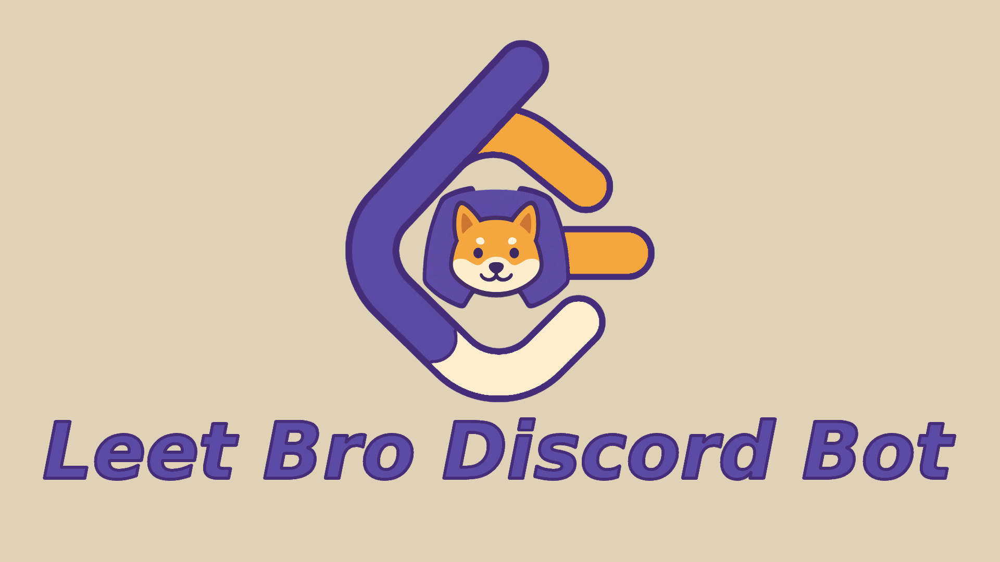

# LeetBro 🤖

A Discord bot that showcases your accepted LeetCode solutions directly in your server.

## 📌 Features

🔗 Link your LeetCode account to your Discord profile.

📬 Get a private DM whenever you complete a new problem.

🙋 Choose whether to share your solution with your server.

📢 Post problem details (title, description, difficulty, stats, and submission link) to a dedicated channel.

🧵 Automatically create discussion threads for each problem, so your server can collaborate on solutions.

## 🚀 Setup
### For Server Admins

- Invite LeetBro to your server. [invite link](https://top.gg/bot/1387318923904553051).
- Run /set-channel to set the channel where solutions will be posted.

### For Users
- Run /subscribe <leetcode_username> to link your LeetCode account.
- Whenever you complete a problem on LeetCode, LeetBro will DM you with the option to share it.

## 🛠️ Self-Hosting

LeetBro is hosted by default, but you can also self-host if you prefer.

### Requirements
- Node.js & TypeScript
- PostgreSQL Database
- Discord Bot Token
- GitHub Cron Job for syncing submissions [LeetBro-CronJob Repo](https://github.com/BryanHuynh/LeetBro-CronJob)

#### Environment Variables
DISCORD_TOKEN=[DISCORD BOT TOKEN]

POSTGRES_USER=[POSTGRES USER]

POSTGRES_HOST=[POSTGRES HOST]

POSTGRES_DATABASE=[POSTGRES DATABASE NAME]

POSTGRES_PASSWORD=[POSTGRES DATABASE PASSWORD]

POSTGRES_PORT=[POSTGRES DATABASE PORT]

CLIENT_ID=[DISCORD BOT CLIENT ID]

BEARER_TOKEN=[CUSTOM BEARER TOKEN FOR AUTHENTICATION]

EMAIL=[CRASH REPORT EMAIL]

EMAIL_APP_PASSWORD=[CRASH REPORT EMAIL APP PASSWORD]
